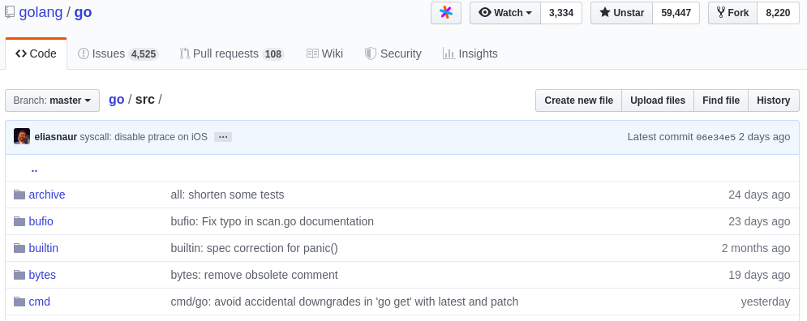
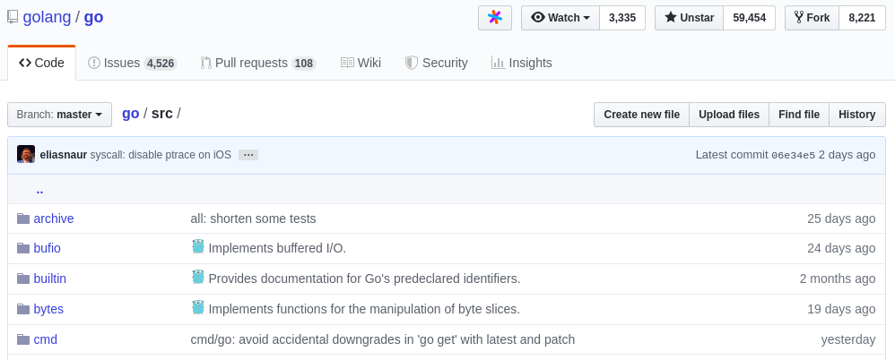

# chrome-github-godoc</h1>

Chrome extension that:

* Replaces Github view of git commit messages with useful godoc.org synopsis.
* Adds an icon with a link to the package in godoc.org.

[Get it on Chrome web store](https://chrome.google.com/webstore/detail/github-godoc/fhlenghekakdnaamlbkhhnnhdlpfpfej)

Before:

After:

